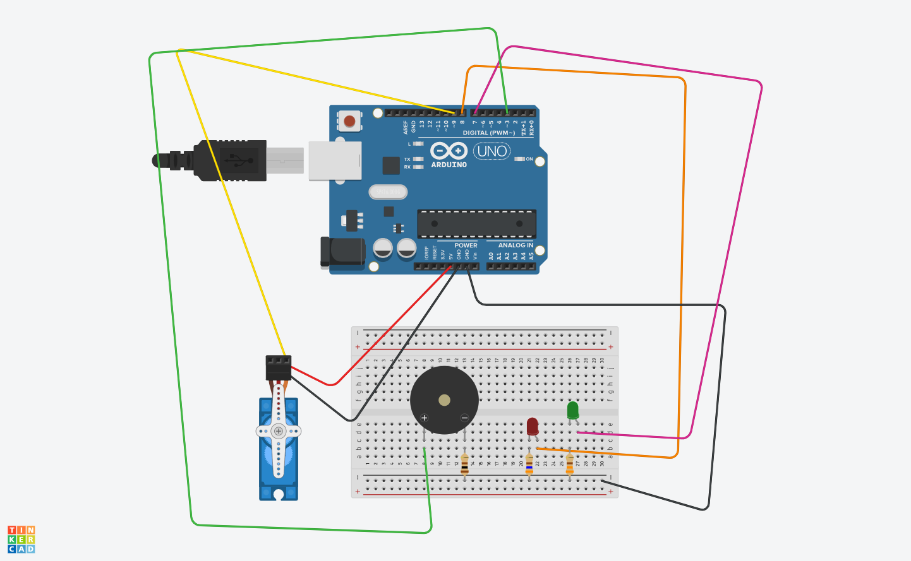

# arduinoTapCode
a place to hold code and notes for a arduino version of tap code

see installation 

https://youtu.be/eBWl2LzMHhE

https://www.tinkercad.com/things/8StbBElGs78?sharecode=Hnxz5xLMH15EByGir1Vit3z762ZyBjixj45YVJIc8lU

for the real build I am using: 

simple piezo 

use EF92A 180d analog micro servo.  not the EF90D 360d digital servo, as this one keeps spinning during delay()

Follow link for more information

https://github.com/greggelong/tapcode

I am now coding up the other direction. 

That is a way for a person to tap on a button or button like switch 

to send the code

I am using a pull down resistor and some code to keep from debouncing

code that was covered in Massimo Banzi, Michael Shiloh - Make_ Getting Started with Arduino

I am also using millis() to keep track of the time betten button pushes so  the computer knows

when the second set of taps is comming

This is like the commputers attentioin span, if the pause between taps is greater that 1 second it will beging

counting the next set of taps

I also have a Javascript version of this encoding taps:

https://github.com/greggelong/tapCodeIn

and live at

https://greggelong.github.io/tapCodeIn

